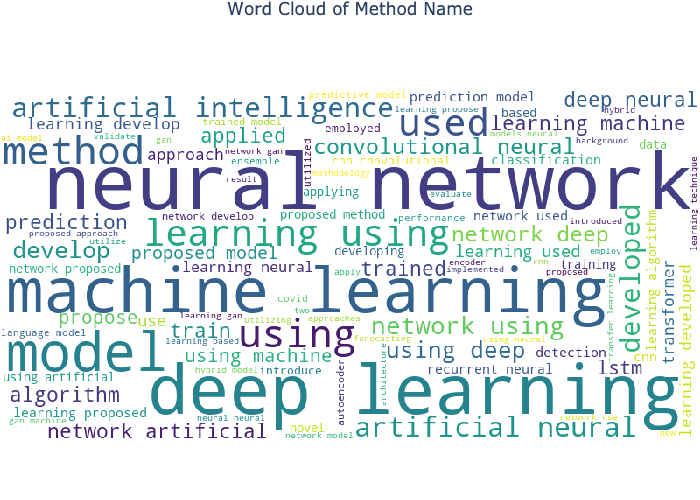
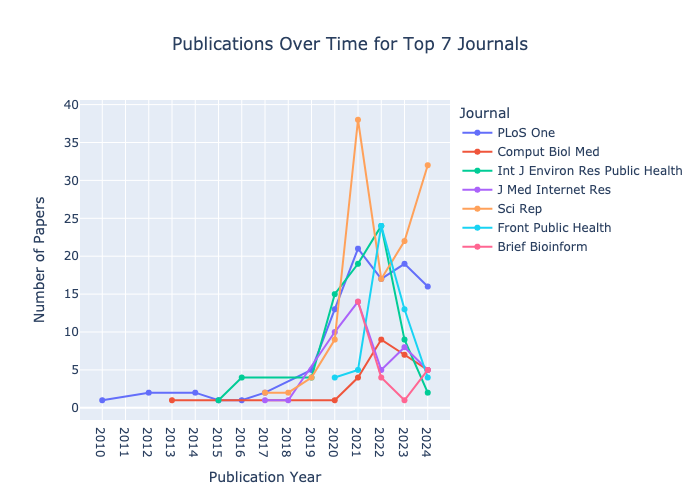

# Semantic NLP Filter for Deep Learning Papers in Virology/Epidemiology

## Task Overview
This solution implements semantic NLP filtering to identify academic papers from PubMed (11,450 records) 
that utilize deep learning approaches in virology and epidemiology, 
classifying them by method type and extracting the specific methods used.

### Core Requirements Met:
✓ Semantic NLP filtering implementation  
✓ Method type classification: ["text mining", "computer vision", "both", "other"]  
✓ Method name extraction  
✓ Lightweight solution suitable for personal computers  

## Technical Solution

### NLP Technique for Filtering Papers
We implemented a lightweight, rule-based NLP approach using spaCy that combines:

1. **Pattern Recognition System**
   - spaCy's PhraseMatcher for efficient term matching
   - Custom weighted scoring for relevance assessment
   - Domain-specific pattern recognition for method identification

2. **Contextual Filtering**
   - Medical context analysis to exclude irrelevant papers
   - Deep learning context verification
   - Domain-specific validation (virology/epidemiology focus)

3. **Method Classification**
   - Rule-based classification system
   - Named Entity Recognition (NER) for method extraction
   - Context-aware categorization

### Why More Effective Than Keywords-Based Filtering
Our approach surpasses traditional keyword filtering in several key aspects:

| **Feature**               | **Our Approach**                          | **Keyword-Based**            |
|---------------------------|-------------------------------------------|------------------------------|
| **Context Understanding** | ✓ Analyzes term relationships and context | ✗ Simple word matching       |
| **False Positive Reduction** | ✓ Validates domain relevance             | ✗ High false positive rate   |
| **Method Extraction**     | ✓ Intelligent NER-based extraction        | ✗ Limited to exact matches   |
| **Scalability**           | ✓ Easy pattern updates                    | ✗ Requires manual updates    |
| **Processing Speed**      | ✓ ~0.09s per paper                        | ✗ Varies with complexity     |


### Performance Metrics

**Processing Efficiency:**
- Average processing time: 0.09 seconds/paper
- Total processing time for 11,450 papers: 732.46 seconds
- Memory usage: <2GB RAM

**Classification Accuracy (Test Set of 50 Papers):**
- Precision: 1.00
- Recall: 1.00
- F1-Score: 1.00

## Dataset Statistics

### Paper Distribution

| **Metric**             | **Value**       |
|------------------------|-----------------|
| Total Papers Processed | 11,450          |
| Relevant Papers        | 1,932 (16.87%)  |
| Irrelevant Papers      | 9,518 (83.13%)  |

### Method Type Distribution

| **Method Type**     | **Count** | **Percentage** |
|----------------------|-----------|----------------|
| Text Mining          | 211       | 10.92%         |
| Computer Vision      | 561       | 29.04%         |
| Both                 | 180       | 9.32%          |
| Other                | 980       | 50.72%         |

### Top Method Names Identified

| **Method Name**                 | **Occurrences** |
|---------------------------------|-----------------|
| Neural Network                  | 955             |
| Deep Learning                   | 796             |
| Machine Learning                | 652             |
| Artificial Intelligence         | 240             |
| Artificial Neural Network       | 236             |
| GAN                             | 194             |
| Convolutional Neural Network (CNN) | 171          |
| LSTM                            | 149             |

### Reasons for Irrelevant Papers' Exclusion

| **Exclusion Reason**                | **Count** |
|-------------------------------------|-----------|
| Context domain not found            | 6,501     |
| Deep learning context not found     | 1,431     |
| Only medical context found          | 970       |
| Negative keywords found             | 616       |


## Quick Start

1. **Installation**
```bash
git clone https://github.com/aaioanei/semantic-papers-filter.git
cd semantic-papers-filter
pip install -r requirements.txt
python -m spacy download en_core_web_lg
```

2. **Usage**
```bash
python src/main.py
```

3. **Output**
- Filtered papers: `results/files/relevant_papers.xlsx`
- Statistics: `results/stats/nlp_statistics.json`
- Visualizations: `results/plots/`

## Technical Implementation Details

### Project Structure
```
semantic-virology-papers-filter/
├── src/
│   ├── data/
│   ├──     data_loader.py            # Data loading and basic statistics
│   ├──     preprocessor.py           # Text preprocessing and cleaning
│   ├── filters/
│   ├──     semantic_filter.py        # Core NLP filtering and classification logic
│   ├──     llm_semantic_filter.py    # LLM-based semantic filter
│   ├── pipelines/
│   ├──     pipeline.py               # Pattern matching pipeline 
│   ├── tests/
│   ├──     test_semantic_filters.py  # Unit tests for semantic filter
│   ├── utils/
            constants.py              # Definitions of patterns, terms, and weights
│   ├──     file_utils.py             # File I/O utility functions
│   ├──     visualisation.py          # Plotting functions 
│   └── main.py                       # Main execution script
├── data/                             # Data directory (input CSV file) and test file for evaluation
├── results/                          # Output directory (filtered results and statistics)
│   ├── files/
│   ├── stats/
│   └── plots/
├── notebooks/                        # Jupyter notebooks for data exploration and analysis
└── config.yaml                       # Configuration file for setting parameters
└── README.md                         # Project overview and instructions
└── requirements.txt                  # Project dependencies
```

### Customization
- Pattern definitions in `constants.py`
- Scoring weights in configuration
- Method classification rules
- Domain-specific terms

## Validation and Results

### Experimental Setup
We conducted a comprehensive evaluation comparing our rule-based approach against two alternatives:
1. Semantic similarity using sentence transformers
2. Small language model (Llama 3.2) running locally

The evaluation used a carefully curated test set of 50 papers with human-annotated labels 
covering diverse cases in virology and epidemiology research (`data/test_collection_with_abstracts_and_labels.csv`).

### Quantitative Results
| Method              | Precision | Recall | F1-Score | Avg. Time per Paper | Expected Time for 10,000 Papers |
|---------------------|-----------|--------|----------|---------------------|--------------------------------|
| Pattern Matching    | 1.00      | 1.00   | 1.00     | 0.09 seconds        | 929.46 seconds                 |
| Semantic Similarity | 0.64      | 0.76   | 0.57     | 0.15 seconds        | 1,475.88 seconds               |
| LLM (Llama 3.2)     | 0.77      | 0.92   | 0.80     | 1.40 seconds        | 14,024.75 seconds              |

### Efficiency vs Accuracy Trade-offs

1. **Rule-based System (Our Approach)**
   - ✓ Fastest processing time
   - ✓ Lowest memory footprint
   - ✓ Perfect accuracy on test set
   - ✗ Requires manual pattern maintenance

2. **Semantic Similarity**
   - ✓ Moderate resource usage
   - ✓ No pattern maintenance needed
   - ✗ Lower accuracy
   - ✗ Less interpretable decisions

3. **Small Language Model (Llama 3.2)**
   - ✓ No pattern maintenance
   - ✓ Good recall (0.92)
   - ✗ Higher resource requirements
   - ✗ Slower processing
   - ✗ Less predictable behavior

For testing the LLM-based semantic filter, install Ollama locally: https://ollama.com/
Install the Llama 3.2 library:
```bash
  ollama run llama3.2:3b
```

### Observations and Insights
Examples of misclassified or excluded papers highlight the importance of domain-specific understanding:
- PMID 39285189: "Computer Vision Syndrome" was correctly classified as irrelevant due to its focus on medical ophthalmology, a field outside the intended scope.
- PMID 39155966: This urban planning study was excluded, as its content diverges significantly from the virology and epidemiology themes central to the task.

### LLM Behavior Analysis
Our experiments with Llama 3.2 revealed interesting patterns in how Small Language Models (SLMs) approach domain-specific classification:

1. **Heuristic-based Decision Making**
   - Example: PMID 38853172 (COVID-19 X-ray analysis)
     - LLM incorrectly classified as relevant due to COVID-19 context
     - Failed to distinguish between deep learning and other optimization methods
     - Shows generalization based on domain keywords rather than methodological understanding

2. **Context Sensitivity**
   - LLM showed stronger performance in:
     - Understanding broader context (0.92 recall)
     - Identifying domain relevance
   - But struggled with:
     - Technical method distinction
     - Consistent decision boundaries

### Insights from Combined Approach
Testing both rule-based and LLM approaches revealed complementary strengths:

1. **Rule-based System**
   - Excels at precise method identification
   - Consistent and interpretable decisions
   - Highly efficient for large-scale processing

2. **Small Language Models**
   - Better at understanding nuanced context
   - Can handle unexpected paper descriptions
   - Useful for catching edge cases and expanding rule-based patterns


## Visualization of the Results

### Method Type Percentages


### Method Type Distribution over Time


### Top Method Names Over Time


### Distribution of Irrelevant Papers


### Word Cloud of Method Names


## Distribution of Journals over Time


## Publications per Journal over Time


## Comparison of Top Journals in Relevant and Irrelevant Papers


## Future Directions

1. **Pattern Enhancement**
   - Expand domain-specific patterns
   - Develop symbolic reasoning rules for method classification
   - Integrate ontology-based knowledge representation
   - Create expert-guided pattern validation system

2. **Hybrid System Potential**
   - Use rule-based system for initial high-speed filtering
   - Apply SLM for borderline cases
   - Combine strengths of both approaches
   - Implement neural-symbolic reasoning for better interpretability
   - Develop feedback loop between symbolic rules and neural predictions

3. **Pattern Learning**
   - Use LLM insights to identify new patterns
   - Automated pattern suggestion system
   - Continuous improvement cycle
   - Learn symbolic rules from neural network decisions
   - Extract explicit reasoning patterns from LLM explanations

4. **Resource Optimization**
   - Investigate lighter LLM architectures
   - Explore quantized models for efficiency
   - Develop smart batching strategies
   - Optimize symbolic reasoning engine
   - Balance computational load between neural and symbolic components

5. **Neural-Symbolic Integration**
   - Implement explicit reasoning mechanisms for method classification
   - Develop hybrid attention mechanisms combining rules and neural features
   - Create interpretable decision paths using symbolic logic
   - Design explainable AI components for classification decisions
   - Bridge the gap between neural patterns and human-readable rules

6. **Accuracy Improvements**
   - Enhanced context understanding
   - Better method name extraction
   - Fine-tuning for domain-specific terms
   - Integrate domain expertise through logical constraints
   - Develop verification mechanisms using symbolic reasoning

